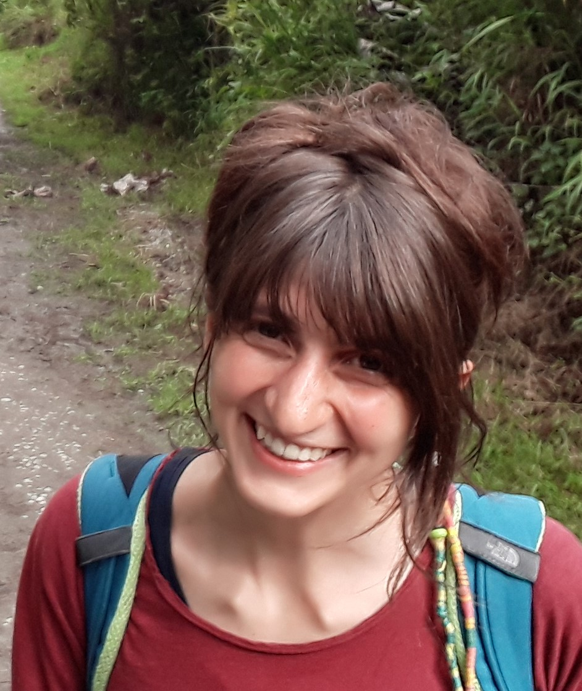
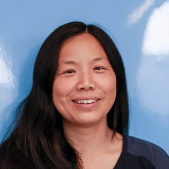

  <a class="button btn btn-secondary" href="#schedule">Workshop Schedule</a>&nbsp;&nbsp;&nbsp;&nbsp;
  <a class="button btn btn-info" href="#speakers">Speakers</a>&nbsp;&nbsp;&nbsp;&nbsp;
  <a class="button btn btn-primary" href="#call-for-submissions">Submission Process</a>&nbsp;&nbsp;&nbsp;&nbsp;
  <a class="button btn btn-warning" href="#dates">Important dates</a>&nbsp;&nbsp;&nbsp;&nbsp;
  <a class="button btn btn-light" href="#people">People</a>&nbsp;&nbsp;&nbsp;&nbsp;

**📅 When:** 9th of October 2026

**📍 Where:** Naples, Italy – collocated with [ICMI 2026](https://icmi.acm.org/2026/) 

<!-- **Submission website:** [OpenReview](https://openreview.net/group?id=ACM.org/ICMI/2026/Workshop/LaugHSMI) -->

### About the workshop
**LaugHSMI** (Laughter, Humour, Smiles in Multimodal Interactions) is a workshop dedicated to advancing research on the role of laughter, smiles, and humor in human-computer interaction and multimodal communication. These phenomena are fundamental aspects of human social interaction, yet they remain challenging to detect, interpret, and generate in computational systems.

Laughter and smiling serve multiple communicative functions beyond expressing amusement—they facilitate social bonding, regulate conversation flow, signal understanding, and convey complex emotional states. Humor adds another layer of complexity, involving cognitive, linguistic, and cultural dimensions. Understanding and modeling these phenomena is crucial for creating more natural, engaging, and socially intelligent interactive systems.

This workshop brings together researchers from affective computing, natural language processing, computer vision, speech processing, human-computer interaction, and social signal processing to address the unique challenges posed by laughter, smiles, and humor in multimodal interactions. We aim to foster interdisciplinary dialogue and advance the state-of-the-art in detecting, analyzing, and generating these important social signals.

<h3 id="schedule">Program</h3>
---
*The program below is tentative and is subject to change.*

|---------------------------------|------------------------------------------------------------------------------------------------------------------------------------------------------------------------------------|
|                                 |
|---------------------------------|------------------------------------------------------------------------------------------------------------------------------------------------------------------------------------|
| 09:00&#8288;&#8211;&#8288;09:05 | Introduction                                                                                                                                                                       |
| 09:05&#8288;&#8211;&#8288;10:00 | **Keynote:** [Hayley Hung](#hayley) (chair: TBD)                                                                                                                                   |
|---------------------------------|------------------------------------------------------------------------------------------------------------------------------------------------------------------------------------|
| 10:00&#8288;&#8211;&#8288;10:30 | Coffee break                                                                                                                                                                       |
|---------------------------------|------------------------------------------------------------------------------------------------------------------------------------------------------------------------------------|
|                                 | **Morning session** (chair: TBD)                                                                                                                                                   |
| 10:30&#8288;&#8211;&#8288;10:50 | *Luca Bischetti*, 'Do funny parents raise funny children? Parental affiliative humor and humor precocity in infancy and toddlerhood'                                               |
| 10:50&#8288;&#8211;&#8288;11:10 | *Vladislav Maraev, Erik Lagerstedt, Christine Howes, Catherine Pelachaud*, 'Investigating the effects of agent-produced paralinguistic respirations associated with apologies'     |
| 11:10&#8288;&#8211;&#8288;11:30 | *Yingqin Hu, Elizaveta Sirotina, Vladislav Maraev, Catherine Pelachaud*, 'Toward Adaptive Laughing Agents: Lessons from the Red Ball Game'                                         |
|---------------------------------|------------------------------------------------------------------------------------------------------------------------------------------------------------------------------------|
| 11:30&#8288;&#8211;&#8288;12:25 | **Keynote:** [Chiara Mazzocconi](#chiara) (chair: TBD)                                                                                                                             |
|---------------------------------|------------------------------------------------------------------------------------------------------------------------------------------------------------------------------------|
| 12:30&#8288;&#8211;&#8288;13:30 | Lunch break                                                                                                                                                                        |
|---------------------------------|------------------------------------------------------------------------------------------------------------------------------------------------------------------------------------|
|                                 | **Afternoon session** (chair: TBD)                                                                                                                                                 |
| 13:30&#8288;&#8211;&#8288;13:50 | *Xinyan Ye, Gwyneth Phang, Anandha Gopalan, Abbas Edalat*, 'Embodied Empathy: A Multimodal AR and LLM-Powered System for Self-Attachment Psychotherapy with Self‑Initiated Humour' |
| 13:50&#8288;&#8211;&#8288;14:10 | *Sofia Callejas, Catherine Pelachaud, Brian Ravenet, Valentin Barriere*, 'Decoding Humor in Stand-up Comedy: A Multilingual and Multimodal Sequence Labeling Approach'             |
|---------------------------------|------------------------------------------------------------------------------------------------------------------------------------------------------------------------------------|
| 14:10&#8288;&#8211;&#8288;14:30 | General Discussion & Closing remarks                                                                                                                                               |

<h3 id="speakers">Keynote Speakers</h3>
---

#### Chiara Mazzocconi
INSERM, Institut de Neurosciences des Systémes, Aix–Marseille Université, Marseille, France
& 
CNRS, ILCB, Institute of Language, Communication, and the Brain, Aix-en-Provence, France

{:width="200px"}

*“Semantics and Pragmatics of Laughter: adult interaction, development and neurodiversity”*

> Laughter is pervasive in human language use, yet its semantic and
> pragmatic status remains insufficiently understood. While often
> treated as a purely affective or paralinguistic signal, laughter
> systematically contributes to meaning construction both as a
> stand-alone utterance and in interaction with speech. I will review
> empirical data and theories leading to the development of an account
> of laughter as a context-sensitive signal that contributes to
> meaning both independently and in interaction with speech. I argue
> that laughter encodes the ascription of incongruity and affective
> stance, and modulates utterance interpretation in ways that support
> pragmatic inference (e.g. irony, mitigation, affiliation). Drawing
> on interactional, clinical and developmental data, I will show that
> laughter exhibits increasing pragmatic flexibility over time, being
> informative about children’s cognitive and linguistic
> development. More broadly, laughter demonstrates how non-verbal
> signals contribute to both meaning construction and conversation
> management, highlighting the need to extend dialogue semantics and
> pragmatics beyond verbal language to multimodal resources, with
> implications for the modelling and design of embodied conversational
> agents.

Chiara Mazzocconi is a researcher in language and developmental
science at Aix-Marseille University. Originally trained as a Speech
and Language Therapist, she subsequently obtained an MSc in
Neuroscience, Language and Communication from University College
London and a PhD in Language Sciences from Université Paris Cité. Her
interdisciplinary research investigates how social communication
develops and unfolds in interaction, with a particular focus on
laughter as a window onto pragmatic, cognitive and interpersonal
processes. Combining naturalistic, experimental and computational
approaches, she studies communication across development and
neurotypes, from early caregiver–child interaction to adult
conversation. Her current research focuses particularly on
interpersonal dynamics in typical and atypical neurodevelopment,
including autism and deaf and hard-of-hearing populations.

#### Hayley Hung

Technical University of Delft, Netherlands

{:width="200px"}

*“What is laughter in the wild? Investigating machine perception of laughter as a multimodal multisensor problem”*

> In this talk, I will discuss two works that tried to investigate the
> multimodal nature of laughter. Traditionally, it has been viewed as
> a predominantly vocal phenomenon with some exceptions acknowledging
> the physical nature of it. In this talk, I will discuss the
> practical and technical challenges of in the wild laughter
> detection, specifically investigating the role of annotator
> subjectivity, modality access, and its influence on model learning.

Hayley Hung is an Associate Professor at the Technical University of Delft, working on Socially Aware Surveillance Systems. She leads the recently formed Perceptive Computing Lab, which is part of the Pattern Recognition and Bioinformatics Group. Previously, she had a Marie Curie Postdoctoral Research fellowship on the AnaSID (Analysing Social Interactions from a Distance) project, in the Intelligent Autonomous Systems Group at the University of Amsterdam, working with Ben Krose. Before that, she was a PostDoc at IDIAP working on multimodal meeting analysis for modelling dominance and influence in meetings, working with Daniel Gatica-Perez. Before this, she was at Queen Mary University Vision Group as a PhD student supervised by Sean Gong. 

<h3 id="people">People</h3>
---

<h4 id="organizers">Organizers</h4>

* [Valentin Barriere, University of Chile](https://valbarriere.github.io/)
* [Sofia Callejas, Université Paris-Saclay & Universidad de Chile](https://cl.linkedin.com/in/sofia-paz-callejas-8024b6200/es)
* [Vladislav Maraev, University of Gothenburg](https://maraev.me/)
* [Chiara Mazzocconi, Aix-Marseille Université](http://www.llf.cnrs.fr/en/Gens/Mazzocconi)
* [Catherine Pelachaud, Sorbonne University](https://www.isir.upmc.fr/personnel/pelachaud/)
* [Brian Ravenet, Université Paris-Saclay](https://brianrave.net/)

<h4 id="committee">Program committee</h4>

- Jürgen Trouvain
- Andy Lücking
- Yingqin Hu
- Vladislav Maraev
- Isabella Poggi
- Matthieu Chollet
- Christine Howes
- Luca Bischetti
- Abdellah Fourtassi
- Gregory A. Bryant
- Béatrice Priego-Valverde
- Sofia Callejas

**Primary Contacts**: [Workshop Mail](mailto:laughsmi_orga@googlegroups.com)

**To Be Announced**

<h3 id="call-for-submissions">Call for submissions</h3>

We invite submissions on the following topics:

* **Detection and Analysis:**
  - Automatic detection of laughter, smiles, and humor in multimodal data
  - Acoustic, visual, and linguistic features of laughter and smiling
  - Temporal dynamics and synchronization of laughter in conversations
  - Cross-cultural variations in laughter, smiling, and humor expression
  - Spontaneous vs. posed laughter and smiles

* **Understanding and Modeling:**
  - Computational models of humor comprehension and generation
  - Functions of laughter in social interaction and conversation management
  - Emotional and pragmatic aspects of laughter and smiling
  - Multimodal fusion approaches for laughter and smile recognition
  - Deep learning and transformer-based models for humor and laughter

* **Applications:**
  - Laughter and humor in human-agent and human-robot interaction
  - Affective dialogue systems incorporating laughter and humor
  - Therapeutic applications: laughter yoga, humor therapy
  - Entertainment and gaming applications
  - Social robotics and embodied conversational agents
  - Detection of genuine vs. social laughter in mental health assessment

* **Datasets and Evaluation:**
  - Corpora and datasets of natural laughter, smiles, and humor
  - Annotation schemes and inter-rater reliability challenges
  - Evaluation metrics for laughter detection and humor generation
  - Ethical considerations in laughter and humor research

<h3 id="submissions">Submission process</h3>

Submission to the LaugHSMI workshop is **double-blind**. The workshop accepts short research papers (4 pages, excluding references) and full-length papers (8 pages, excluding references). Authors are required to follow standard [ACM ICMI paper format](https://www.acm.org/publications/proceedings-template).

Short research papers can describe work in progress, position papers, datasets, or research papers that have been already published in another venue (conference or journal) in the last 12 months that are relevant to LaugHSMI's topics of interest. For already published works, please submit a summarized four-page short paper.

All submissions should be submitted through OpenReview before the deadline (see important dates below).

All submissions will be reviewed by at least two non-conflicting reviewers. All papers will be presented during a dedicated poster session. Selected full-length and short papers will also be presented as oral presentations throughout the day.

It is expected that at least one author of each accepted paper will register for the workshop and present the work during the event. Online presentations will be considered for presenters who cannot attend in person due to visa or personal constraints.

If you have any questions, do not hesitate to contact the organizers (see contacts below).

<h3 id="dates">Important dates</h3>
* Papers submission deadline: July 10th, 2026
* Papers acceptance notification: July 22nd, 2026
* Camera-ready deadline: August 1st, 2026
* Workshop: October 5-9, 2026

*All deadlines are 23:59 Anywhere on Earth (AoE)*
